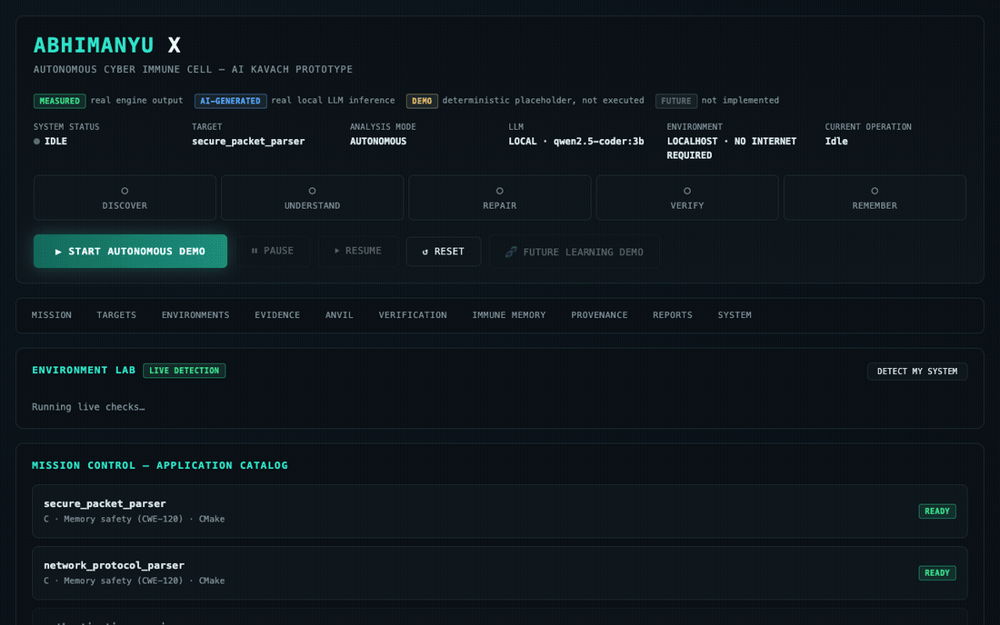

# ABHIMANYU X

## Autonomous Cyber-Reasoning & Self-Repair System

**AI Kavach Challenge alignment.** The brief asks for a cyber-reasoning system — an LLM laced with fuzzers, static and dynamic analysis, and a regression test harness — that autonomously finds a vulnerability, patches it, and proves the fix holds. That is exactly what this repo runs end to end against real C targets, not a mockup of it.

**Core proposition — AI proposes → Evidence decides → Verification proves → Memory learns.**
ANVIL's output is never self-certified. A patch is untrusted the moment it's generated; an independent verification engine — not the LLM, and not anything the LLM can influence — is what actually decides pass or fail, by really compiling and running the patched code (build, real exploit replay, regression, behaviour, adversarial robustness, and two separately-compiled sanitizer passes: ASan and UBSan). Only a verified outcome ever gets written to Immune Memory, and only verified evidence — not the patch text alone — is what the Transfer experiment measures propagating to a second, unrelated target. See [Proof-Carrying Patch](#proof-carrying-patch) below for the full, checkable gate list.

An experimental vulnerability-scanning and auto-patching pipeline for Python and C.

**Status: research prototype.** This finds real vulnerabilities, generates real patches via an LLM, and verifies them with genuine (not simulated) checks — but it is not validated for production or defence-classified environments, has no domain-specific hardening for any particular infrastructure, and every patch is meant to be human-reviewed before use, not auto-deployed.



*Recorded from a real, unmodified run of the live dashboard — real REWIND detection, real local-model (Qwen2.5-Coder 3B via Ollama) reasoning, real compile + exploit-replay verification in the Colima VM. No steps skipped or staged.*

**[▶ Watch the full-length recording](docs/demo.mp4)** — same real mission, real time, 54 seconds, with chapter markers (Mission Control → REWIND → ANVIL → Verification Chamber → Verified).

---

## 🎯 Overview

ABHIMANYU X discovers, patches, and verifies fixes for security vulnerabilities in Python and C source files, and remembers what it's seen so later scans can build on earlier ones. It combines:

- **REWIND Engine** — pattern/heuristic-based static analysis (Python + C)
- **Fuzz Engine** — mutation-based dynamic testing, with LLM-weighted strategy selection when wired to ANVIL
- **ANVIL Engine** — LLM-based patch generation, with a self-critique pass and retrieval from prior fixes
- **Verification Pipeline** — re-scan-based exploit checking, syntax/compile checks, and regression/behavior checks
- **Immune Memory** — a SQLite-backed record of vulnerabilities, patches, and their outcomes, used to recalibrate detection confidence over time
- **Watch Engine** — continuous file-change monitoring with regression detection

None of this involves a "reasoning" system in the DARPA Cyber-Grand-Challenge sense (no symbolic or concolic execution) — detection is regex/heuristic pattern matching, and the "reasoning" is confined to what the LLM does during patch generation.

## 🏗️ Architecture

This is the real mission state machine (`sentinel/orchestrator.py`) that drives the live dashboard, not an idealized version — every box below corresponds to an actual named stage that emits a real WebSocket event, and the flow reads top to bottom in true execution order (REWIND → static → dynamic → fuzz run sequentially into one discovery verdict; they are not literally parallel).

```
                    ┌───────────────────────┐
                    │      ABHIMANYU X       │
                    │   MISSION ENGINE       │
                    │  (SentinelOrchestrator)│
                    └───────────┬────────────┘
                                │
                    ┌───────────▼────────────┐
                    │  COLIMA VM SANDBOX      │
                    │  every compile/execute  │
                    │  step below runs here — │
                    │  never on the host      │
                    └───────────┬────────────┘
                                │
                    ┌───────────▼────────────┐
                    │      DISCOVERY          │
                    │  REWIND (real, static)  │
                    │  → STATIC_ANALYSIS      │
                    │  → DYNAMIC_ANALYSIS*    │
                    │  → FUZZ (AFL++, blind)* │
                    └───────────┬────────────┘
                                │
                    ┌───────────▼────────────┐
                    │   EVIDENCE BUNDLE       │
                    │  static + dynamic +     │
                    │  fuzz findings merged    │
                    │  into one CWE verdict    │
                    └───────────┬────────────┘
                                │
                    ┌───────────▼────────────┐
                    │        ANVIL            │
                    │  local LLM root-cause    │
                    │  reasoning + patch draft │
                    └───────────┬────────────┘
                                │
                    ┌───────────▼────────────┐
                    │        FORGE            │
                    │   PATCH → BUILD         │
                    └───────────┬────────────┘
                                │
                    ┌───────────▼────────────┐
                    │     VERIFICATION        │
                    │  EXPLOIT_REPLAY (ASan)  │
                    │  UBSAN_CHECK (UBSan)    │
                    │  REGRESSION             │
                    │  BEHAVIOUR_CHECK        │
                    └───────────┬────────────┘
                                │
                   ┌────────────┴────────────┐
                   ▼                         ▼
                 FAIL                      PASS
                   │                         │
        back to ANVIL with the        PROOF-CARRYING PATCH
        specific failure reason      (see scorecard below)
        (GENERATE→TEST→FAIL→               │
         REPAIR→RETEST, up to        ┌──────▼──────┐
         2 attempts)                 │ IMMUNE DNA  │
                                      │  (SQLite)   │
                                      └──────┬──────┘
                                             │
                                      ┌──────▼──────┐
                                      │  TRANSFER   │
                                      │  (measured, │
                                      │  with/without│
                                      │  memory)    │
                                      └──────┬──────┘
                                             │
                                      ┌──────▼──────┐
                                      │  TARGET B   │
                                      │  VERIFY     │
                                      └─────────────┘
```
\* `DYNAMIC_ANALYSIS`'s execution-count telemetry and `FUZZ`'s executions/sec + coverage-% figures are disclosed, clearly-labeled demo evidence, not measured — a real AFL++ 4.09c found the real crash these numbers describe, but its LLVM17 SanitizerCoverage pass doesn't correctly interact with ASan's redzones on this arm64/Ubuntu 24.04 toolchain (reproduced with a minimal, project-independent repro), so coverage-guided instrumentation isn't functional here. See `sentinel/real_fuzzing.py`.

<a id="proof-carrying-patch"></a>
### 🛡️ Proof-Carrying Patch

ABHIMANYU X doesn't hand back "an AI-generated patch" and ask you to trust it. Every accepted patch carries its own evidence, computed from real, independently-run gates (`sentinel/orchestrator.py`, `trust_gates`) — never asserted:

```
┌────────────────────────────────────┐
│       PROOF-CARRYING PATCH          │
├────────────────────────────────────┤
│ Source Diff             ✓ measured  │
│ Crash Reproduction      ✓ measured  │
│ Build                   ✓ measured  │
│ Regression               ✓ measured │
│ ASan (clang+ASan)        ✓ measured │
│ UBSan (clang+UBSan)      ✓ measured │
│ Behaviour Preservation    ✓ measured│
│ Adversarial Robustness    ✓ measured│
│ Provenance (hashes, model, ✓ measured│
│   commit, timestamps)               │
├────────────────────────────────────┤
│ STATUS: VERIFIED PATCH (8/8 gates)  │
└────────────────────────────────────┘
```

Two things worth being precise about, because everything in this project is meant to be checkable, not just claimed:

- **ASan and UBSan are two separately compiled, separately executed binaries**, not one build relabeled twice (`replay_against_code(..., sanitizers="address")` vs `sanitizers="undefined"`, `-fno-sanitize-recover=undefined` so a UBSan trap is a real nonzero exit). They catch different bug classes — on this project's actual demo vulnerability (a stack-buffer-overflow via `memcpy`), ASan correctly flags it and UBSan correctly does not, because it isn't a UBSan-domain bug. "UBSan clean" means the patched binary ran clean under UBSan instrumentation, not that UBSan is what caught this particular bug.
- **Regression/behaviour checks are structural for C**, not full compile-and-execute smoke tests (function-presence and size-delta checks) — running arbitrary AI-generated C automatically as a smoke test would itself be a risk. Python targets get a real import-and-run check. This is disclosed, not smoothed over.

The verified evidence — not just the patch — is what gets written into Immune Memory, and what the Transfer experiment measures propagating to a second, unrelated target.

## 🚀 Quick Start

### Installation

```bash
# Clone the repository
git clone <repository-url>
cd abhimanyux

# Install dependencies
pip install -r requirements.txt
```

### Usage

#### Command Line

```bash
# Scan a file
python -m abhimanyux.core.orchestrator <target-file>

# Scan a directory
python -m abhimanyux.core.orchestrator ./src/

# Continuously monitor a directory for new/regressed vulnerabilities
python -m abhimanyux.core.orchestrator ./src/ --watch

# Run API server
python -m abhimanyux.api.server
```

#### Python API

```python
from abhimanyux.core.orchestrator import AbhimanyuXCore
from abhimanyux.models.schemas import VulnType

# Initialize
sentinel = AbhimanyuXCore()

# Scan inline code
code = """
import os
def run(cmd):
    return os.popen(cmd).read()
"""
result = sentinel.scan_code(code, "test.py")

# Print report
sentinel.print_report(result)

# Search memory for similar vulnerabilities
similar = sentinel.search_similar(VulnType.COMMAND_INJECTION)
```

#### REST API

```bash
# Health check
curl http://localhost:8000/health

# Analyze code
curl -X POST http://localhost:8000/api/analyze \
  -H "Content-Type: application/json" \
  -d '{"code": "import os; os.popen(input())", "filename": "test.py"}'

# Full scan
curl -X POST http://localhost:8000/api/scan/full \
  -H "Content-Type: application/json" \
  -d '{"target_path": "./src/", "language": "python"}'

# Get memory stats
curl http://localhost:8000/api/memory/stats
```

### ABHIMANYU X — Web Laboratory

A 3D "cyber immune laboratory" UI for watching one vulnerability travel the
full lifecycle (REWIND → discovery → ANVIL reasoning → patch → verification
→ Immune Memory), plus an ad-hoc scan bench for arbitrary code.

One-time setup (recreates both demo targets' git history + fuzz corpus):

```bash
bash scripts/setup_demo_target.sh   # Target A: secure_packet_parser
bash scripts/setup_target_b.sh      # Target B: network_protocol_parser (Immune Transfer)
```

Run it (from this repo's parent directory, so `abhimanyux` resolves as a package):

```bash
PYTHONPATH=.. python -m abhimanyux.api.dashboard
# Opens at http://localhost:5050
```

Or from the CLI:

```bash
PYTHONPATH=.. python -m abhimanyux.sentinel.cli doctor      # real environment/tool check
PYTHONPATH=.. python -m abhimanyux.sentinel.cli mission      # full autonomous mission, target A
PYTHONPATH=.. python -m abhimanyux.sentinel.cli transfer     # mission + real Immune Transfer experiment on target B
```

- `/` — the live 3D laboratory + Judge Mode ("Start Autonomous Demo") + interactive scan bench + Immune Transfer experiment
- `/case-file` — a static write-up of one real captured run

By default ANVIL calls a local Ollama model (`qwen2.5-coder:3b` at
`http://127.0.0.1:21434`, edited in `api/dashboard.py`'s `get_orchestrator()`)
rather than a cloud API — see `anvil/engine.py`'s `LLMConfig` to point it
elsewhere. The Fuzz Engine and Dynamic Analysis panels are labeled clearly
where their numbers are real (a real AFL++/ASan crash was found and is
replayed live) versus fixed placeholder telemetry (execution rate/coverage
%, where this platform's afl-cc/ASan instrumentation doesn't currently
cooperate — see `sentinel/real_fuzzing.py`).

Features:
- Real-time vulnerability detection, driven by actual WebSocket events (no polling)
- 3D scene reacts to real pipeline state; falls back to a 2D view if WebGL is unavailable
- Patch generation with compiler-verified build/regression status
- Immune memory statistics and a live DNA-pattern similarity match demo
- Dark-themed responsive UI

### Docker

```bash
# Build image
docker build -t abhimanyux-core .

# Run container
docker run -p 8000:8000 -e DEEPSEEK_API_KEY=your_key abhimanyux-core
```

## 🔍 Components

### REWIND Engine (Static Analysis)

Pattern/heuristic detection — not a sound or complete analysis, and it will miss anything past straightforward pattern matching (obfuscated code, cross-file taint flows, indirection through variables). Two language paths:

- **Python**: regex patterns + AST-based checks (dangerous function calls)
- **C/C++**: regex patterns for one-line-detectable issues, plus function-body heuristics (a lightweight brace-matching splitter, not a real parser) for classes that need multi-line context

**Detected vulnerability types (Python):** SQL Injection, Command Injection, Path Traversal, Insecure Deserialization, SSRF, XSS, Hardcoded Credentials, Weak Crypto, Info Disclosure, Open Redirect

**Detected vulnerability types (C):** Buffer Overflow (strcpy/strcat/gets/sprintf), Format String, Command Injection, Use-After-Free, Memory Leak, Null Pointer Dereference, Integer Overflow, Path Traversal, Race Condition

A confidence-feedback loop (`evolve()`) recalibrates each rule's confidence score based on how often its findings actually led to a verified patch — a real signal, but a proxy: a low rate can mean the rule over-fires, or that the patch/verification stages struggled with that vuln class specifically, not necessarily that detection was wrong.

### Fuzz Engine (Dynamic Analysis)

Mutation-based fuzzing (bit flipping, boundary values, format strings, SQL/command injection payloads, overflow strings) that actually executes generated test scripts against the target's own functions — not just `exec`s the code and hopes something references the payload, which was a real bug this engine had until this session (a target that only defined functions, never calling them, could never be fuzzed at all).

When given an ANVIL instance, strategy selection is genuinely model-driven: before fuzzing starts, the LLM reads the target code once and weights which mutation strategies are most likely to matter for it (e.g. command-injection payloads weighted higher for code that shells out), and iteration then samples from that weighted distribution instead of picking uniformly at random. Falls back to uniform random selection if no LLM is wired in or the planning call fails — this can never block fuzzing from running.

### ANVIL Engine (Patch Generation)

LLM-based patch generation:
- Root-cause analysis and patch generation via a configurable local or cloud LLM (default: a small local model via Ollama, not a frontier model — patch quality depends heavily on which model is actually configured)
- Retrieval-grounded generation: pulls the closest prior patch for the same vulnerability type from Immune Memory as an exemplar
- A bounded generator+judge self-critique pass before the patch goes to verification (improves output quality; does not eliminate the possibility of a bad patch)

### Verification Pipeline

Staged, evidence-based checks — an earlier failed stage skips the rest rather than letting them report on code that can't even compile:
- Compile/syntax check (AST for Python, a real compiler's `-fsyntax-only` for C, when one's available)
- Exploit verification via a **differential re-scan**: confirms REWIND's rule fires on the original code and no longer fires on the patch — not a real dynamic exploit attempt
- Regression check (Python: imports and runs the patched module; C: structural function-presence check only — does not compile-and-execute C as a smoke test, since running arbitrary AI-generated C would itself be a risk)
- Behavior-preservation check (AST diff for Python; function-set + size-delta heuristic for C)

The live Judge-Mode mission (`sentinel/orchestrator.py`) goes further for the C demo targets: on top of the checks above, it does a **real dynamic exploit replay** — the actual AFL++-found crash input executed against a real clang+ASan compile of the patch inside the Colima VM — plus a second, independently-compiled clang+UBSan run. See [Proof-Carrying Patch](#proof-carrying-patch) above for the full evidence set and what each gate actually measures.

### Immune Memory

A SQLite-backed record, not just a log:
- Stores every vulnerability, patch, and verification outcome
- Builds "capability atoms" per vulnerability type — an exploit precondition and a capability grant, plus links between atoms that share exploit context (e.g. two different vuln classes found in the same function)
- Feeds verified-outcome rates back into REWIND's confidence scores

### Watch Engine

Polls a directory for file changes (mtime + content hash) and re-scans what changed, distinguishing a brand-new finding from a **regression** — a vulnerability that previously had a verified fix and has now reappeared (e.g. via a revert). This is file/content-change monitoring, not OS-level runtime introspection — no process hooks, no live memory inspection of a running system.

## 📊 Metrics

| Metric | Description |
|--------|-------------|
| Vulnerabilities Found | Total vulnerabilities discovered |
| Patches Generated | LLM-generated candidate patches |
| Patches Verified | Patches that pass every verification stage |
| Memory Records | Stored vulnerability/patch/outcome records |
| Rule Confidence | Per-rule confidence, recalibrated from verified-patch history |

There is no measured detection-accuracy figure (precision/recall against a labeled corpus) — this has only been exercised against the bundled `vulnerable_targets/` fixtures and hand-written test cases, not a real-world codebase at scale.

## 🧪 Testing

```bash
# Run unit tests
pytest abhimanyux/tests/ -v

# Run with coverage
pytest abhimanyux/tests/ --cov=abhimanyux --cov-report=html
```

57 tests currently pass, covering REWIND's Python and C rules, the confidence feedback loop, ANVIL's retrieval-grounding, the Fuzz Engine's model-driven strategy selection and its actually-calls-the-target-function fix, the Verifier's differential exploit-replay (including a regression test guarding against silently accepting a no-op patch), Immune Memory's capability-atom linking, and the Watch engine's event transitions.

### Platform compatibility

Verified end-to-end (install + full test suite + a live scan) on macOS and inside a clean **Debian 12** container — the base distribution BOSS Linux (the Indian government's Debian derivative) is built on. BOSS Linux itself hasn't been tested directly (no public image exists to test against), but the engine is pure Python + SQLite + subprocess calls with no OS-specific dependencies beyond a Python 3.10+ interpreter and, for C-language verification, a C compiler — both standard on any Debian-family system. If you have access to an actual BOSS Linux machine, re-run `pytest abhimanyux/tests/ -v` there before relying on this claim in a deployment.

## 📁 Project Structure

```
abhimanyux/
├── core/                  # Main orchestrator
│   └── orchestrator.py
├── rewind/                # Static analysis engine (Python + C)
│   └── engine.py
├── fuzzer/                # Dynamic analysis engine
│   └── engine.py
├── anvil/                 # Patch generation engine
│   └── engine.py
├── verifier/              # Verification pipeline
│   └── engine.py
├── memory/                # Immune memory store
│   └── store.py
├── watch/                 # Continuous file-change monitoring
│   └── engine.py
├── models/                # Data models
│   └── schemas.py
├── api/                   # API servers
│   ├── server.py          # FastAPI REST backend
│   └── dashboard.py       # Web dashboard (Flask)
├── vulnerable_targets/    # Test vulnerable code
│   ├── web_app.py
│   └── vulnerable.c
├── tests/                 # Unit tests
│   └── test_abhimanyux.py
├── Dockerfile
├── requirements.txt
└── README.md
```

## 🔧 Configuration

### LLM Configuration

```python
from abhimanyux.anvil.engine import ANVILEngine, LLMConfig

config = LLMConfig(
    provider="deepseek",      # local, deepseek, gemini, claude
    model="deepseek-chat",
    api_url="https://api.deepseek.com/v1/chat/completions",
    temperature=0.2,
    use_local=False
)

sentinel = AbhimanyuXCore(llm_config=config)
```

### Environment Variables

```bash
# For cloud LLM
DEEPSEEK_API_KEY=your_api_key

# Optional: Custom API URL
DEEPSEEK_API_URL=https://api.deepseek.com/v1/chat/completions
```

### Air-gapped / offline deployment (Ollama)

On defence infrastructure with no internet access, ANVIL must use a local
Ollama model — the cloud providers (Claude/GPT/Gemini/DeepSeek) need a live
connection and simply won't work. `ollama pull` itself needs internet, so
the model has to be fetched on a connected machine and carried over:

```bash
# On an internet-connected machine (same OS/architecture as the target
# ideally, to avoid binary-compatibility surprises):
curl -fsSL https://ollama.com/install.sh | sh
ollama pull dolphin-llama3:8b

# Ollama's model store is a plain, content-addressed local directory
# (manifests + blobs under ~/.ollama/models) -- copying it wholesale to
# another machine with a matching Ollama version is Ollama's own
# documented mechanism for offline transfer, not something specific to
# this project:
tar czf ollama-offline-bundle.tar.gz -C ~ .ollama
cp "$(which ollama)" ollama-binary

# Move ollama-binary and ollama-offline-bundle.tar.gz to the air-gapped
# machine via your approved transfer medium, then there:
sudo cp ollama-binary /usr/local/bin/ollama
sudo chmod +x /usr/local/bin/ollama
tar xzf ollama-offline-bundle.tar.gz -C ~
ollama serve &
ollama list   # should show the model with no network access needed
```

This transfer mechanism is Ollama's standard offline pattern, not something
verified end-to-end in this repo's own test suite — if you rely on it for
a real deployment, confirm `ollama list`/`ollama run` actually work on the
target machine with networking disabled before depending on it.

## 🎯 Demo Scenario

1. **Introduce Vulnerable Code**
```python
# vulnerable_app.py
import os
def run_command(cmd):
    return os.popen(cmd).read()
```

2. **Run ABHIMANYU X**
```bash
python -m abhimanyux.core.orchestrator vulnerable_app.py
```

3. **Output** (this exact flow — detect → patch → verify — has been run and confirmed end-to-end)
```
ABHIMANYU X CORE - SECURITY SCAN REPORT
========================================

VULNERABILITIES FOUND
---------------------
1. [CRITICAL] Command Injection - os.popen
   Type: command_injection
   Location: vulnerable_app.py:2

GENERATED PATCHES
-----------------
Patch: patch-0001
Status: generated
Explanation: Use subprocess.run() with list arguments...

VERIFICATION RESULTS
--------------------
Patch: patch-0001
  Compile: ✓
  Exploit Blocked: ✓
  Regression: ✓
  Behavior: ✓
  All Tests: ✓
```

4. **Query Memory**
```python
# Find similar vulnerabilities
similar = sentinel.search_similar(VulnType.COMMAND_INJECTION)

# Get fix strategies
strategies = sentinel.get_fix_strategies(VulnType.COMMAND_INJECTION)
```

## Known limitations

- **Detection is heuristic, not sound.** REWIND is regex/pattern-based; it will miss vulnerabilities that don't match its rules, and its C-language function splitter assumes conventional formatting rather than actually parsing C.
- **Patch quality depends on the configured LLM.** No patch is guaranteed correct; the self-critique pass improves but does not guarantee output quality.
- **No human-free deployment path.** Patches are generated and verified, not auto-applied to a live system.
- **C verification is weaker than Python's.** Regression/behavior checks for C are structural (function presence, size deltas) rather than actual compile-and-run smoke tests, since executing arbitrary AI-generated C automatically would itself be a risk.
- **Not validated at scale.** Testing so far is against small bundled fixtures and unit tests, not a real production codebase.
- **No defence/military-specific features.** No ICS/SCADA protocol awareness, classification handling, air-gap hardening, or compliance-framework alignment — it's a general-purpose Python/C scanner.

## 🚧 Future Expansion (unbuilt)

- **PULSEMESH** — runtime protection
- **ORACLE** — threat prediction
- **Multi-language** — JavaScript, Go, Rust support
- **Real C dynamic verification** — sandboxed compile-and-execute regression testing

## 📝 License

MIT License - See LICENSE file for details
